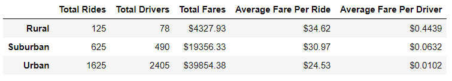
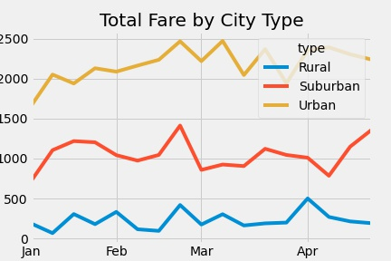

# PyBer_Analysis

## Overview
This analysis was requested to illustrate the differences between urban, suburban, and rural areas for our userbase. It utilizes data from 1/1/2019 through 5/8/2019 to evaluate start of year through current information.

## Results
This analysis evaluated the following six metrics to paint a larger picture.

* Total usage followed expectations, with urban centers having the largest usage followed by suburban and rural.
* Total driver counts also followed expectations in the same way as total usage.
* Total fares also followed expectations with the largest revenue coming from urban areas followed by suburban and rural.
* Average fare per ride reversed the prior trend, with rural areas generating the most revenue per ride, followed by suburban and urban.
* Average fare per driver showed a similar trend to the average fare per ride, with drivers generating the largest value in rural areas.

* As shown above, the majority of weekly revenue comes from urban areas followed by suburban and rural.

## Summary

In summary, the cost structure at present generates the most revenue from urban areas while rides in rural areas present the largest value to drivers. Additional analysis is required to determine rider value in rural areas to see if we may want to consider expanding operations in rural areas or if we may want to increase revenues in urban centers.

In absence of additional analysis, we may wish to increase incentives to rural drivers to increase availability for users. An increased driver pool will also spread 'word of mouth' to local populations, providing free advertising.

For urban areas, a small cost increase may be worth investigating to improve our revenue per ride, or using a "laffer-like" curve to determine what maximizes our revenue for these centers without compromising our userbase.

For suburban areas, we could consider a combination of both - increasing revenue and driver support - to maximize revenues.
